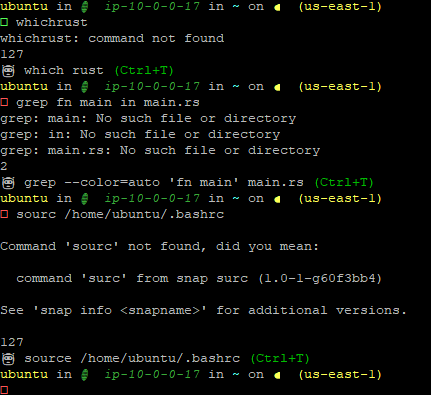

# aishell

`aishell` is a smart shell assistant that understands commands sent to the shell. If a command fails or is typed incorrectly (e.g., "gerp" instead of "grep"), `aishell` suggests a fix for the command. The fix is placed into the shell history, so the user can press the up arrow and hit enter to execute the corrected command.



## Supported Environments

1. Ubuntu using Bash with Starship

** Feel free to submit PRs for other systems. **

## To Do

1. Support more systems. Perhaps we can detect the length of the prompt to support prompts that don't have their own line, unlike how Starship has its own line.

## Installation

To install `aishell` on Ubuntu using bash, follow these steps:

1. Clone the repository:
    ```sh
    git clone https://github.com/yourusername/aishell.git
    cd aishell
    ```

2. Build the project:
    ```sh
    cargo build --release
    ```

3. Move the binary to `/usr/local/bin`:
    ```sh
    sudo mv target/release/aishell /usr/local/bin
    ```

4. Run the installation script:
    ```sh
    ./install.sh
    ```

5. Set your OPENAI_API_KEY in your ~/.bashrc file, like:
    ```sh
    export OPENAI_API_KEY="sk-AAAAAAAAAAAAAAAAAAAAAAAAAAAAAAAAAb11111111111111"
    ```

## Usage

To initialize `aishell` in your shell, add the following to your `~/.bashrc` or `~/.zshrc` file:

```sh
eval "$(aishell init bash)"  # For bash
# or
eval "$(aishell init zsh)"   # For zsh
```

For fish shell, add the following to your `~/.config/fish/config.fish` file:

```sh
aishell init fish | source
```

## Manually build.

Add to shell in `~/.bashrc` or `~/.zshrc`:

```sh
eval "$(aishell init bash)"
```

You also have to add a function to enable the (Ctrl+T) functionality:

```sh
aishell_suggestion() {
  local suggestion_file="/tmp/aishell_suggestion"
  if [ -f "$suggestion_file" ]; then
    fix=$(< "$suggestion_file")
    rm -f "$suggestion_file"
    # Put it on the current command line:
    READLINE_LINE="$fix"
    READLINE_POINT=${#fix}
  else
    echo "No suggestion available."
  fi
}
# Bind Ctrl+T to that function
bind -x '"\C-t":aishell_suggestion'
```

Build and move the binary:

```sh
cargo build --release
sudo mv target/release/aishell /usr/local/bin
eval "$(aishell init bash)"  # Or zsh/fish
```
